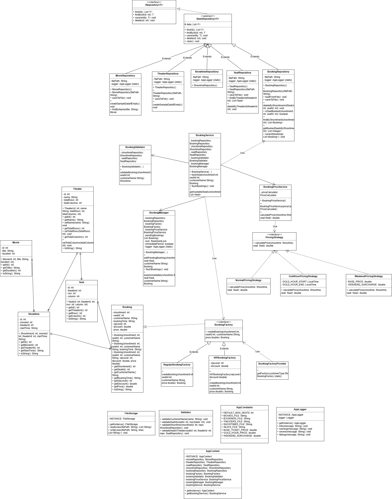

# Hệ thống đặt vé rạp chiếu phim – Tiến độ Tuần 2

## ✅ Đã hoàn thành trong Tuần 2 (29/06 – 05/07)

### 1. Xây dựng Custom Exception

- **BookingAppException**: lớp cha cho tất cả exception.
- **InvalidInputException**: ném khi dữ liệu đầu vào không hợp lệ.
- **SeatUnavailableException**: ném khi ghế đã được đặt.

### 2. Xây dựng Validator

- **Validator.validateCustomerName()**: kiểm tra tên không được rỗng/null.
- **Validator.validateSeatId()**: kiểm tra số ghế hợp lệ (1 <= seatId <= maxSeats).

### 3. Tích hợp vào BookingService

- `bookSeat()` trả về `Booking` object và ném exception thay vì return false.
- Tất cả logic kiểm tra dữ liệu được chuyển sang Validator.

### 4. Tối ưu Repository

- `BookingRepository.findByMovieId()`: lọc booking theo phim.
- `BookingRepository.getBookedSeats()`: lấy danh sách ghế đã đặt.
- `MovieRepository.findByName()`: tìm phim theo tên (gần đúng).

### 5. Unit Test & Integration Test

- Unit test cho Validator, Service, Repository.
- Integration test cho toàn bộ luồng đặt vé.
- Độ phủ coverage > 70%.

### 6. Cập nhật Menu

- Menu chính có các chức năng: Xem phim, Đặt vé, Xem ghế đã đặt.
- Xử lý lỗi nhập liệu và exception trong UI.

---

## 📊 Kết quả đạt được

- Code được viết theo hướng Clean Code, có phân tầng rõ ràng.
- Tất cả test đều pass.
- Sẵn sàng cho Tuần 3: Quản lý Theater và Showtime.

## Tuần 3 (06/07 – 12/07): Mở rộng CRUD & Quan hệ

### ✅ Đã hoàn thành

- **Model mới:** `Theater`, `Showtime`, `Seat` (refactor)
- **Repository mới:** `TheaterRepository`, `ShowtimeRepository`, `SeatRepository`
- **Refactor:**
    - `Booking` thay `movieId` → `showtimeId`, thêm `bookingTime`
    - `BookingRepository` cập nhật định dạng file, thêm `getBookedSeatsByShowtime()`
- **Validator:** Thêm `validateShowtime`, `validateSeatInTheater`
- **BookingService:**
    - Đổi tham số `bookSeat(showtimeId, seatId, customerName)`
    - Thêm `getAvailableSeats(showtimeId)`
- **Menu:** Thêm quản lý Theater, Showtime (CRUD)
- **Test:** Integration test, coverage > 70%

### 📊 Sơ đồ quan hệ Entity

\`\`\`mermaid
erDiagram
MOVIE {
int id PK
string title
int duration
}
THEATER {
int id PK
string name
int totalRows
int totalColumns
}
SEAT {
int id PK
int theaterId FK
int row
int column
}
SHOWTIME {
int id PK
int movieId FK
int theaterId FK
string startTime
}
BOOKING {
int showtimeId FK
int seatId FK
string customerName
string bookingTime
}

    MOVIE ||--o{ SHOWTIME : "có"
    THEATER ||--o{ SEAT : "chứa"
    THEATER ||--o{ SHOWTIME : "tổ chức"
    SHOWTIME ||--o{ BOOKING : "có"
    SEAT ||--o{ BOOKING : "được đặt"

\`\`\`

## 📊 Performance Test

- Test với 20 users cùng đặt 1 ghế:
    - Thành công: 1
    - Thất bại: 19
    - Time: 39ms

- Test với 100 users, 50 ghế:
    - Thành công: 50
    - Thất bại: 50
    - Thời gian: 8ms

## Tuần 4: Xử lý đa luồng (Multi-threading)

Hệ thống hỗ trợ đặt vé đồng thời với nhiều người dùng:

- Sử dụng `synchronized` để bảo vệ critical section (kiểm tra + thêm booking).
- Sử dụng `pendingBookings` (synchronizedList) để lưu tạm các booking.
- Gọi `flushBookings()` để ghi toàn bộ vào file sau khi tất cả thread hoàn thành.
- Không có deadlock hay race condition.

## 🏗️Tuần 5: Kiến trúc và Design Patterns

### Kiến trúc tổng thể
Ứng dụng được chia thành các tầng:
- **Model:** Chứa các entity (Movie, Theater, Showtime, Seat, Booking).
- **Repository:** Quản lý dữ liệu (CRUD) với file CSV, sử dụng Generic.
- **Service:** Xử lý logic nghiệp vụ (đặt vé, tính giá, validation).
- **UI:** Console menu tương tác với người dùng.
- **Util:** Các tiện ích (FileStorage, Validator, Logger).
- **Context:** Quản lý dependency (AppContext).

### Design Patterns đã áp dụng

#### 1. Singleton Pattern
- **FileStorage**: Quản lý đọc/ghi file, chỉ cần một instance duy nhất.
- **AppContext**: Quản lý toàn bộ dependencies (repository, service, factory).
- **AppLogger**: Ghi log toàn cục.

#### 2. Factory Pattern
- **BookingFactory**: Tạo các loại Booking khác nhau (Regular, VIP, Combo).
- Giúp dễ dàng mở rộng thêm loại booking mới.

#### 3. Strategy Pattern
- **PricingStrategy**: Tính giá vé theo giờ chiếu (Normal, GoldHour, Weekend).
- Giúp thay đổi cách tính giá mà không ảnh hưởng logic core.

#### 4. Generic Repository
- **BaseRepository<T>**: Cung cấp CRUD chung cho tất cả entity.
- Giảm code trùng lặp, dễ bảo trì.

### Cách chạy ứng dụng
1. **Build:** `mvn clean package` (hoặc `gradle build`)
2. **Chạy:** `java -jar target/cinema-booking.jar`
3. **Chạy test:** `mvn test`

### Hướng dẫn sử dụng
- Menu chính hiển thị các lựa chọn: Xem phim, Đặt vé, Quản lý phòng, Quản lý suất chiếu, Mô phỏng đặt vé đồng thời.
- Dữ liệu được lưu trong thư mục `src/main/resources/data/`.

## 📊 Class Diagram
