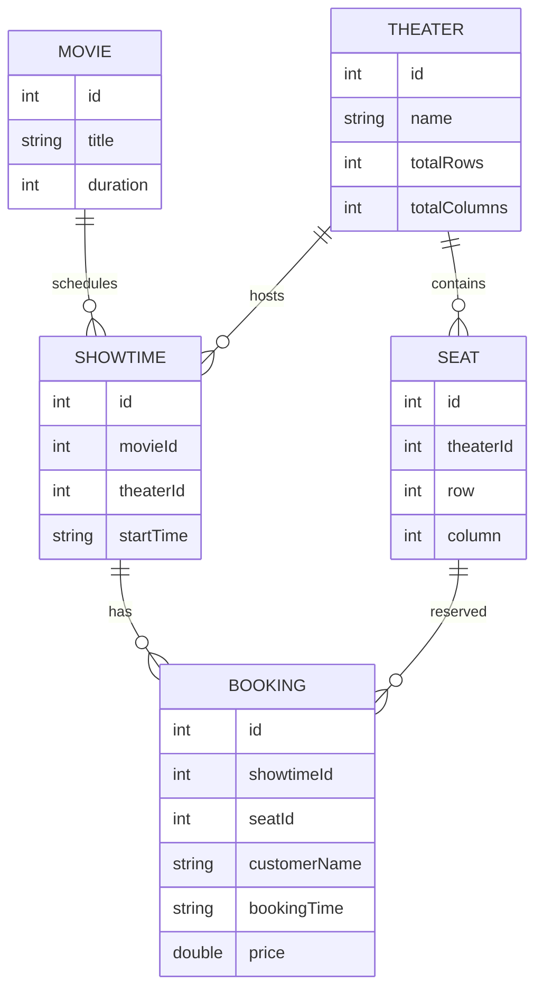

# 🏗️ Architecture

This document describes the architecture, package organization, design patterns, and data flow of the **Cinema Booking System**.

---

# 1. Architecture Overview

The project follows a **Layered Architecture**, separating the application into distinct layers with clear responsibilities.

```text
                +----------------------+
                |      Console UI      |
                |  Main, BookingUI     |
                +----------+-----------+
                           |
                           v
                +----------------------+
                |    Service Layer     |
                |   BookingService     |
                +----------+-----------+
                           |
                           v
                +----------------------+
                |  Repository Layer    |
                | CRUD & File Storage  |
                +----------+-----------+
                           |
                           v
                +----------------------+
                |      CSV Files       |
                +----------------------+
```

Each layer communicates only with the layer directly below it, making the system easier to maintain, test, and extend.

---

# 2. Package Structure

```text
src/main/java/com/cinema
│
├── context/
│   └── AppContext
│
├── exception/
│   ├── BookingAppException
│   ├── InvalidInputException
│   └── SeatUnavailableException
│
├── factory/
│   ├── BookingFactory
│   ├── RegularBookingFactory
│   ├── VIPBookingFactory
│   └── ComboBookingFactory
│
├── model/
│   ├── Movie
│   ├── Theater
│   ├── Showtime
│   ├── Seat
│   └── Booking
│
├── pricing/
│   ├── PricingStrategy
│   ├── NormalPricingStrategy
│   ├── GoldHourPricingStrategy
│   └── WeekendPricingStrategy
│
├── repository/
│   ├── BaseRepository<T>
│   ├── MovieRepository
│   ├── TheaterRepository
│   ├── ShowtimeRepository
│   ├── SeatRepository
│   └── BookingRepository
│
├── service/
│   └── BookingService
│
├── simulation/
│   └── BookingSimulation
│
├── ui/
│   ├── Main
│   ├── BookingUI
│   ├── TheaterUI
│   └── ShowtimeUI
│
└── util/
    ├── AppLogger
    ├── FileStorage
    └── Validator
```

---

# 3. Layer Responsibilities

## UI Layer

Responsible for interacting with the user.

Responsibilities include:

* Display menus
* Read keyboard input
* Display results
* Delegate business logic to services

Classes:

* Main
* BookingUI
* TheaterUI
* ShowtimeUI

---

## Service Layer

Contains the application's business logic.

Responsibilities include:

* Booking tickets
* Seat availability validation
* Ticket pricing
* Booking history
* Revenue calculation

Current service:

* BookingService

---

## Repository Layer

Handles data persistence.

Responsibilities include:

* CRUD operations
* Reading CSV files
* Writing CSV files
* Searching entities

Repositories inherit common functionality from `BaseRepository<T>`.

---

## Model Layer

Represents business entities.

Current entities:

* Movie
* Theater
* Showtime
* Seat
* Booking

---

## Utility Layer

Provides reusable helper components.

Examples:

* FileStorage
* Validator
* AppLogger

---

# 4. UML Class Relationships

The following diagram illustrates the high-level relationship between the major components.

```text
                 BookingUI
                      │
                      ▼
              BookingService
                      │
      ┌───────────────┼───────────────┐
      ▼               ▼               ▼
BookingRepository ShowtimeRepository SeatRepository
      │               │               │
      └───────────────┼───────────────┘
                      ▼
                 CSV Storage
```

---

# 5. Entity Relationship



---

# 6. Booking Workflow

The following sequence describes the ticket booking process.

```text
User

 │
 ▼

BookingUI

 │
 ▼

BookingService

 │
 ├── Validate input
 │
 ├── Find showtime
 │
 ├── Find seat
 │
 ├── Check seat availability
 │
 ├── Calculate ticket price
 │
 ├── Create Booking
 │
 └── Save booking

 ▼

BookingRepository

 │
 ▼

CSV File
```

---

# 7. Design Patterns

## Singleton Pattern

Used for globally shared resources.

Classes:

* AppContext
* FileStorage
* AppLogger

Advantages:

* Single instance
* Easy dependency sharing
* Reduced resource usage

---

## Factory Pattern

Encapsulates booking creation.

Factories:

* RegularBookingFactory
* VIPBookingFactory
* ComboBookingFactory

Advantages:

* Simplifies object creation
* Easy to add new booking types
* Supports Open/Closed Principle

---

## Strategy Pattern

Encapsulates pricing algorithms.

Strategies:

* NormalPricingStrategy
* GoldHourPricingStrategy
* WeekendPricingStrategy

Advantages:

* Flexible pricing
* Easy to extend
* No modification of BookingService

---

## Generic Repository Pattern

Provides reusable CRUD functionality.

```text
BaseRepository<T>

        ▲

        │

 ┌──────┼───────────────┐

Movie Theater Showtime Seat Booking
Repository Repository Repository Repository Repository
```

Advantages:

* Eliminates duplicated code
* Easier maintenance
* Consistent repository API

---

# 8. Thread Safety

The application supports concurrent ticket booking.

Implementation:

* synchronized
* ExecutorService
* Thread-safe collections

Critical booking operations are synchronized to ensure:

* No duplicate bookings
* No race conditions
* Consistent booking data

Simulation is implemented in:

* BookingSimulation

---

# 9. Data Persistence

The application uses CSV files for persistence.

Each entity has its own repository responsible for loading and saving data.

```text
MovieRepository
        │
        ▼
movies.csv

BookingRepository
        │
        ▼
bookings.csv

SeatRepository
        │
        ▼
seats.csv

ShowtimeRepository
        │
        ▼
showtimes.csv

TheaterRepository
        │
        ▼
theaters.csv
```

---

# 10. Logging and Exception Handling

Logging is centralized using **AppLogger**.

The application defines custom exceptions for business errors.

Examples:

* BookingAppException
* InvalidInputException
* SeatUnavailableException

This improves debugging and keeps business logic clean.

---

# 11. Future Architecture Improvements

Potential improvements include:

* Replace CSV storage with MySQL or PostgreSQL.
* Introduce Spring Boot Dependency Injection.
* Expose RESTful APIs.
* Add authentication and authorization.
* Integrate Docker for deployment.
* Implement CI/CD with GitHub Actions.
* Introduce caching for better performance.
